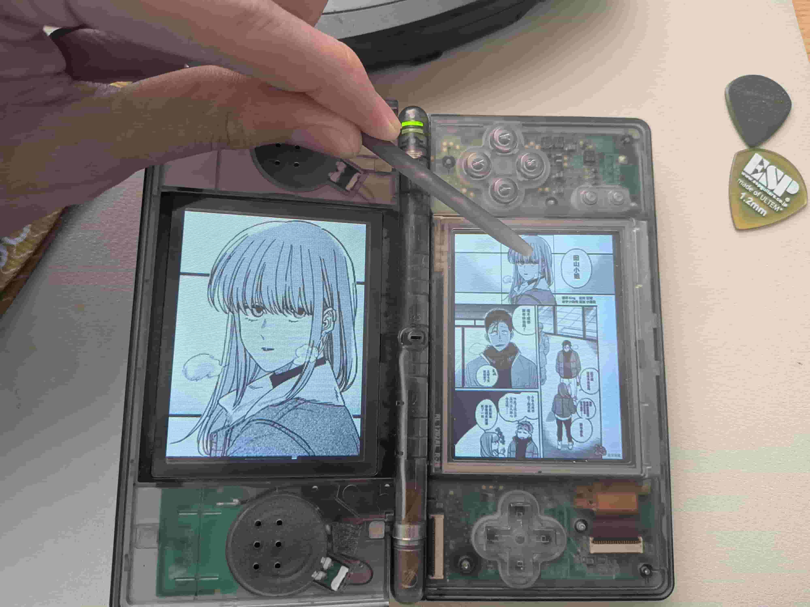
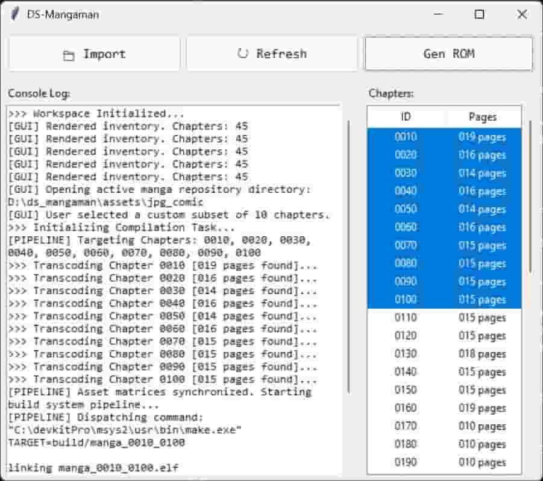

# DS Mangaman

A high-performance, hardware-accelerated 3x Ultra-HD comic book reader for the Nintendo DS. It includes an integrated Python-based preprocessing pipeline packaged into a standalone desktop GUI tool.

---

通过完美的端到端架构，DS Mangaman 彻底打破了复古硬件的物理制约。在任天堂 DS 掌机上通过底层 C++ 定点数硬件加速，实现了前所未有的 3 倍超清双屏动态无损漫画阅读体验。这不仅是一次卓越的逆向性能调优，更是一套将现代高精数字化资产无缝注入老旧硬件的终极闭环解决方案。

---

DS Mangamanは、完美なエンドツーエンドのアーキテクチャにより、レトロハードウェアの物理的制約を完全に打ち破ります。さらにニンテンドーDS実機上では、低層の C++ 固定小数点数によるハードウェア加速を通じて、かつてない 3倍超高画質のデュアルスクリーン動的マンガ閲覧体験を実現しました。これは単なるパフォーマンスの最適化に留まらず、旧世代 of ハードウェアに現代のデジタル資産の生命力を吹き込む、究極のソリューションです。

<div align="center">
  
</div>

## Common Issues

* **File Path Spaces (Compilation Failure)**: The devkitPro toolchain and GNU `make` cannot handle directory paths containing spaces (e.g., `C:\Users\Charles Wong\Downloads`). If you encounter a `No rule to make target` error, simply move the entire project folder to a path with no spaces, such as `C:\ds_mangaman\` or `D:\ds_mangaman\`.
**Mandatory Installation Path (Detection Failure)**: The script validates environmental footprints using a hardcoded array of default paths, targeting `C:\devkitPro`. Installing the development toolchain into a custom path or alternative drive letter is the same as not installing; if a non-default directory is explicitly required, open a GitHub Issue so administrators can append your custom path matrix to the lookup table.

## Features

* **Flashcard & Virtual Filesystem Independence**: By embedding manga assets directly into the inner `.nds` ROM structure via NitroFS, the system bypasses any reliance on specific R4 card FAT kernels, or external virtual filesystem clusters, meaning that it's stable on all avaliable flashcart platforms.
* **3x Ultra-HD Rendering Matrix**: Converts source images into 768x576 assets, providing raw details that far exceed standard NDS screen limitations.
* **Touch Radar Magnifier**: Pressing the stylus on the bottom screen instantly shifts the top screen into an ultra-high-resolution magnifying glass focused on the exact pixel coordinates, paired with a dynamic tracking bounding box.

## Project Structure

To allow users without a local Python environment to easily compile ROMs, the frontend controller has been packaged into a standalone desktop executable. Please ensure the distribution package maintains the following directory structure:

```
ds-mangaman/
├── main_gui.exe (Pre-compiled desktop GUI tool with built-in Python environment)
├── Makefile (Core compiler orchestration and build rules)
├── source/
│   └── main.cpp (Main application logic: dual-screen rendering, touch radar, and NitroFS controls)
├── build/
└── assets/
    ├── devkitProUpdater-3.0.3.exe (Bundled development chain offline setup executable)
    └── jpg_comic/ (Manga source directory, automatically initialized upon first launch)
```

---

## Usage Tutorial

You no longer need to manually configure Python, pip, or global environment variables via the command line. Follow these steps to generate your custom comic `.nds` ROM on any Windows PC.

<div align="center">
  
</div>

### Step 1: Toolchain Setup
The compilation pipeline relies on the official devkitPro build ecosystem.
1. Double-click to run `main_gui.exe` in the release package. If the development toolchain is not detected on your local drives, the application will automatically pop up a dialog to guide you through the setup process.
2. Alternatively, you can directly execute `assets/devkitProUpdater-3.0.3.exe`. In the component selection window, make sure that NDS Development is checked.
3. **Mandatory Installation Path (CRITICAL):** You MUST keep the default installation directory as `C:\devkitPro`! Do not customize or change the path to other drive letters during the installation wizard, otherwise the orchestration program will fail to intercept and dynamically inject the active build environments.
4. **Special Requirements Note:** If you have absolute hardware installation constraints and must change the installation drive or path, please submit an Issue directly on the GitHub project page. Administrator will append your custom path to the automatic detection lookup table in the next release.

### Step 2: Import Manga Assets
1. Click the **Import** button on the graphical user interface. The application will automatically open your local manga repository directory located at `assets/jpg_comic/`.
2. Create subfolders strictly named with **4-digit integers** to represent chapter identifiers (e.g., name Chapter 1 as `0010`, Chapter 2 as `0020`, etc.).
3. Place your manga panels into their respective folders. Images must be sorted sequentially by page numbers (mainstream modern formats such as `.jpg`, `.png`, and `.webp` are fully supported). I will upload a web manga downloader chrome extension shortly (mainly for major english and traditional chinese pirate websites) making it a lot easier.

```
assets/jpg_comic/
├── 0010/ (Chapter 1 folder)
│   ├── 001.jpg
│   ├── 002.jpg
└── 0022/ (Chapter 2b folder)
    ├── 001.png
    └── 002.png
```

### Step 3: Package & Generate ROM
1. Once your images are properly placed, return to the GUI and click the **Refresh** button. The chapter list view on the right will update to display your detected chapter IDs and total page counts.
2. **Select Compilation Target:**
   * You can multi-select any subset of chapters in the list by holding down `Ctrl` or `Shift` to package a custom set of chapters into the ROM.
   * If no specific items are selected, clicking compile will automatically package all discovered chapters in the list.
3. Click the **Gen ROM** button.
4. **Automated Closed-Loop Execution:** The main program will handle NumPy-accelerated image rotation and compression, transcode RGB888 source images to hardware-native 16-bit RGB555 format, build the NitroFS filesystem structure, and silently invoke the underlying devkitARM compiler tools.
5. Upon successful compilation, the software will automatically open the `build/` directory for you, revealing your newly generated `.nds` ROM file ready to be loaded into your NDS flashcard or emulator!
